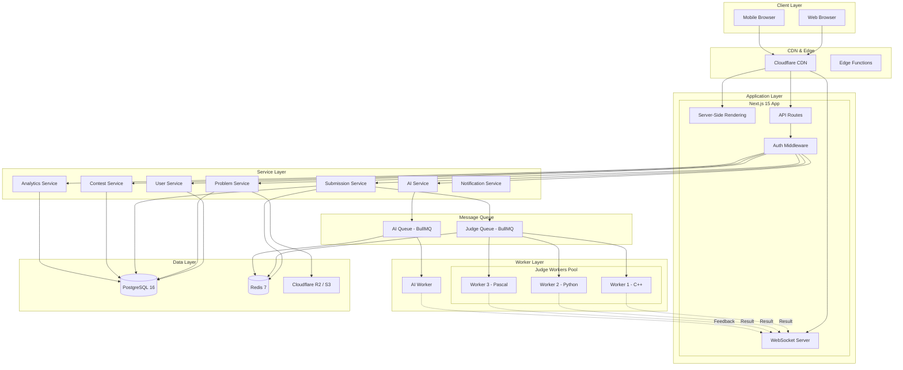
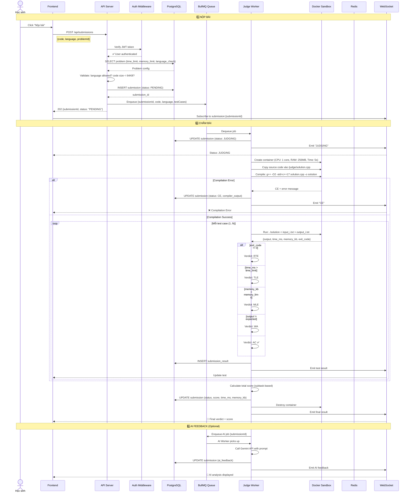
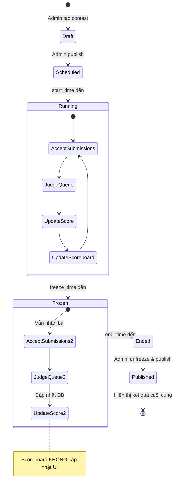
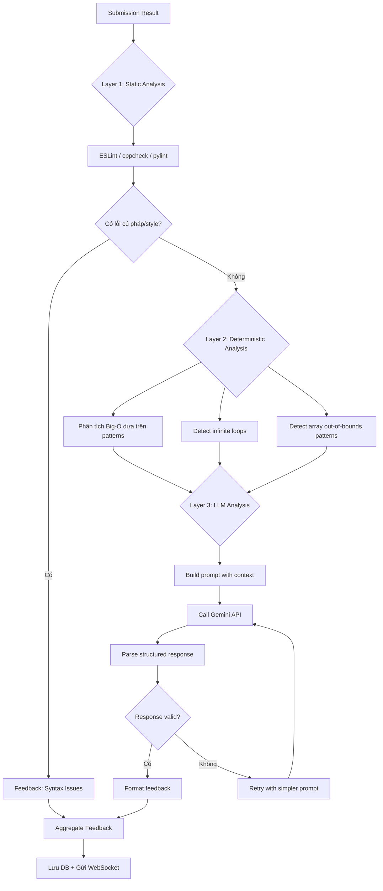
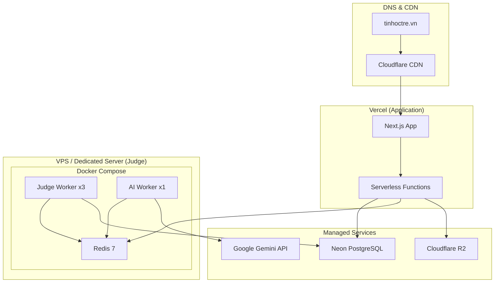

# 🏗️ KIẾN TRÚC HỆ THỐNG - TINHOCTRE PLATFORM

> Tài liệu này mô tả kiến trúc tổng thể, data flow, và deployment strategy cho nền tảng ôn luyện Tin học trẻ.

---

## 1. KIẾN TRÚC TỔNG QUAN

### 1.1. High-Level Architecture



### 1.2. Phân tách Concerns

| Layer | Trách nhiệm | Công nghệ |
|:---|:---|:---|
| **Client** | UI rendering, user interaction, code editing | React 19, Monaco Editor, Scratch VM |
| **Edge** | Caching, DDoS protection, static assets | Cloudflare CDN |
| **Application** | Request routing, authentication, SSR | Next.js 15, NextAuth v5 |
| **Service** | Business logic, data validation | TypeScript modules |
| **Worker** | Code execution, AI inference | BullMQ workers, Docker sandbox |
| **Queue** | Job scheduling, backpressure | Redis + BullMQ |
| **Data** | Persistence, caching, file storage | PostgreSQL, Redis, R2/S3 |

---

## 2. DATA FLOW CHI TIẾT

### 2.1. Luồng nộp bài (Core Flow)



### 2.2. Luồng Contest



---

## 3. SANDBOX ARCHITECTURE

### 3.1. Mô hình Isolation

```
┌─────────────────────────────────────────────────────┐
│                   HOST SERVER                        │
│                                                      │
│  ┌──────────────────────────────────────────────┐   │
│  │            JUDGE WORKER PROCESS               │   │
│  │                                               │   │
│  │  ┌─────────────────────────────────────────┐  │   │
│  │  │        DOCKER CONTAINER (Sandbox)        │  │   │
│  │  │                                          │  │   │
│  │  │  ┌────────────┐   ┌─────────────────┐   │  │   │
│  │  │  │  Compiler   │   │   Executor       │   │  │   │
│  │  │  │  g++/python │   │   ./solution     │   │  │   │
│  │  │  └────────────┘   └─────────────────┘   │  │   │
│  │  │                                          │  │   │
│  │  │  ┌──────────────────────────────────┐   │  │   │
│  │  │  │  /judge/                          │   │  │   │
│  │  │  │  ├── solution.cpp (source code)   │   │  │   │
│  │  │  │  ├── solution    (compiled)       │   │  │   │
│  │  │  │  ├── input.txt   (test input)     │   │  │   │
│  │  │  │  └── output.txt  (program output) │   │  │   │
│  │  │  └──────────────────────────────────┘   │  │   │
│  │  │                                          │  │   │
│  │  │  RESOURCE LIMITS:                        │  │   │
│  │  │  ├── CPU: 1 core                         │  │   │
│  │  │  ├── Memory: 256 MB                      │  │   │
│  │  │  ├── Time: 10s wall clock                │  │   │
│  │  │  ├── Disk: 64 MB                         │  │   │
│  │  │  ├── PIDs: 32 (anti fork bomb)           │  │   │
│  │  │  ├── Network: DISABLED                   │  │   │
│  │  │  └── Filesystem: READ-ONLY (except /judge)│  │   │
│  │  └─────────────────────────────────────────┘  │   │
│  └──────────────────────────────────────────────┘   │
└─────────────────────────────────────────────────────┘
```

### 3.2. Security Layers

| Layer | Biện pháp | Mô tả |
|:---|:---|:---|
| **L1: Container** | Docker with `--security-opt=no-new-privileges` | Không leo thang đặc quyền |
| **L2: Network** | `--network=none` | Không truy cập internet |
| **L3: Filesystem** | Read-only root, tmpfs /judge | Chỉ ghi trong /judge |
| **L4: Resources** | `--cpus=1 --memory=256m --pids-limit=32` | Giới hạn tài nguyên |
| **L5: Syscall** | seccomp profile (whitelist) | Chặn syscalls nguy hiểm |
| **L6: User** | Run as unprivileged user (uid 65534) | Không chạy root |
| **L7: Time** | Wall clock timeout + CPU timeout | Kill process khi hết giờ |

### 3.3. Supported Languages Config

```typescript
// lib/judge/languages.ts
export const LANGUAGES = {
  'cpp17': {
    name: 'C++ 17',
    extension: '.cpp',
    compile: 'g++ -O2 -std=c++17 -o solution solution.cpp',
    run: './solution',
    dockerImage: 'judge-cpp:latest',
    defaultTimeLimit: 1000, // ms
    defaultMemoryLimit: 262144, // KB (256 MB)
  },
  'cpp14': {
    name: 'C++ 14',
    extension: '.cpp',
    compile: 'g++ -O2 -std=c++14 -o solution solution.cpp',
    run: './solution',
    dockerImage: 'judge-cpp:latest',
    defaultTimeLimit: 1000,
    defaultMemoryLimit: 262144,
  },
  'python3': {
    name: 'Python 3',
    extension: '.py',
    compile: null, // interpreted
    run: 'python3 solution.py',
    dockerImage: 'judge-python:latest',
    defaultTimeLimit: 3000, // Python gets 3x time
    defaultMemoryLimit: 262144,
  },
  'pascal': {
    name: 'Free Pascal',
    extension: '.pas',
    compile: 'fpc -O2 solution.pas',
    run: './solution',
    dockerImage: 'judge-pascal:latest',
    defaultTimeLimit: 1000,
    defaultMemoryLimit: 262144,
  },
} as const;
```

---

## 4. AI PIPELINE ARCHITECTURE

### 4.1. Cascaded Evaluation



### 4.2. Prompt Engineering Strategy

```
┌──────────────────────────────────────────────────────────────┐
│                    PROMPT STRUCTURE                            │
├──────────────────────────────────────────────────────────────┤
│                                                               │
│  [SYSTEM ROLE]                                                │
│  Bạn là giáo viên lập trình Tin học trẻ Việt Nam.            │
│  Phản hồi bằng tiếng Việt, phù hợp cấp {grade_level}.      │
│                                                               │
│  [CONTEXT - Problem]                                          │
│  Đề bài: {problem_description}                               │
│  Input format: {input_format}                                 │
│  Output format: {output_format}                               │
│  Constraints: {constraints}                                   │
│  Time limit: {time_limit}ms                                   │
│                                                               │
│  [CONTEXT - Submission]                                       │
│  Ngôn ngữ: {language}                                        │
│  Code: {source_code}                                         │
│  Verdict: {verdict}                                          │
│  Failed test: {test_info}                                    │
│                                                               │
│  [INSTRUCTION]                                                │
│  1. Phân tích TẠI SAO sai (đơn giản, rõ ràng)               │
│  2. Gợi ý HƯỚNG sửa (KHÔNG cho code hoàn chỉnh)            │
│  3. Đánh giá Big-O hiện tại                                  │
│  4. Gợi ý thuật toán phù hợp nếu TLE                        │
│                                                               │
│  [OUTPUT FORMAT]                                              │
│  Trả về JSON: {error_type, explanation, hints[], complexity}  │
│                                                               │
└──────────────────────────────────────────────────────────────┘
```

### 4.3. Cost Control

```typescript
// lib/ai/rate-limiter.ts
export const AI_LIMITS = {
  // Per user per day
  maxReviewsPerUserPerDay: 20,
  
  // Per submission
  maxTokensPerRequest: 2000,
  
  // Global
  maxDailyBudget: 50, // USD
  
  // Caching
  cacheTTL: 24 * 60 * 60, // 24 hours
  
  // Same problem + same error pattern → cache hit
  cacheKeyStrategy: 'problem_id + verdict + error_pattern_hash',
  
  // Model selection based on complexity
  modelSelection: {
    syntaxError: 'gemini-2.0-flash', // cheapest
    logicError: 'gemini-2.0-flash',
    algorithmSuggestion: 'gemini-2.5-pro', // more capable
    fullExplanation: 'gemini-2.5-pro',
  },
};
```

---

## 5. DATABASE INDEXES & PERFORMANCE

### 5.1. Critical Indexes

```sql
-- Problems: filter by board, year, difficulty
CREATE INDEX idx_problems_board ON problems(board);
CREATE INDEX idx_problems_year ON problems(source_year);
CREATE INDEX idx_problems_difficulty ON problems(difficulty);
CREATE INDEX idx_problems_board_year ON problems(board, source_year);

-- Submissions: user history, problem stats
CREATE INDEX idx_submissions_user ON submissions(user_id, submitted_at DESC);
CREATE INDEX idx_submissions_problem ON submissions(problem_id, status);
CREATE INDEX idx_submissions_contest ON submissions(contest_id, user_id);

-- Contest scoreboard: fast ranking
CREATE INDEX idx_participants_score ON contest_participants(contest_id, total_score DESC, total_penalty ASC);

-- Test results: per submission lookup
CREATE INDEX idx_results_submission ON submission_results(submission_id);
```

### 5.2. Caching Strategy

| Data | Cache | TTL | Invalidation |
|:---|:---|:---|:---|
| Problem list | Redis | 5 min | On problem CRUD |
| Problem detail | Redis | 10 min | On problem update |
| User session | Redis | 24 hours | On logout |
| Contest scoreboard | Redis | 5 sec | On submission result |
| AI feedback | Redis | 24 hours | Never (immutable) |
| Test cases | Redis | 1 hour | On test update |

---

## 6. DEPLOYMENT ARCHITECTURE

### 6.1. Production Setup



### 6.2. Chi phí ước tính / tháng

| Service | Plan | Chi phí |
|:---|:---|:---|
| Vercel | Pro | $20/tháng |
| Neon PostgreSQL | Scale | $19/tháng |
| Cloudflare R2 | Pay-as-you-go | ~$5/tháng |
| VPS (Judge Workers) | 4 vCPU, 8GB RAM | $40/tháng |
| Redis Cloud | 250MB | $7/tháng |
| Google Gemini API | Pay-as-you-go | ~$30-100/tháng |
| Domain (.vn) | Hằng năm | $30/năm |
| **Tổng** | | **~$125-200/tháng** |

---

## 7. MONITORING & OBSERVABILITY

### 7.1. Metrics cần theo dõi

```
📊 Application Metrics
├── API response time (p50, p95, p99)
├── Error rate (4xx, 5xx)
├── Active users (concurrent)
├── Page load time
└── WebSocket connections

⚡ Judge Metrics
├── Queue depth (pending jobs)
├── Judge throughput (submissions/min)
├── Average judge time per language
├── Worker utilization %
├── Sandbox creation time
└── Failed judge rate

🤖 AI Metrics
├── AI request latency
├── Token usage per request
├── Daily API cost
├── Cache hit rate
├── Feedback quality score (user rating)
└── Error/timeout rate

💾 Database Metrics
├── Query latency (p95)
├── Connection pool usage
├── Disk usage growth
├── Slow queries log
└── Replication lag (if applicable)
```

### 7.2. Alerting Rules

| Alert | Condition | Severity | Action |
|:---|:---|:---|:---|
| Judge Queue Backed Up | queue_depth > 100 for 5 min | 🔴 Critical | Scale workers |
| API Error Spike | 5xx rate > 5% for 2 min | 🔴 Critical | Investigate logs |
| AI Cost Exceeded | daily_cost > $80 | 🟡 Warning | Review rate limits |
| DB Connection Pool Full | connections > 90% | 🟡 Warning | Increase pool size |
| Disk Usage High | disk > 80% | 🟡 Warning | Archive old data |
| Worker Crash | worker restarts > 3 in 10 min | 🔴 Critical | Check Docker logs |
